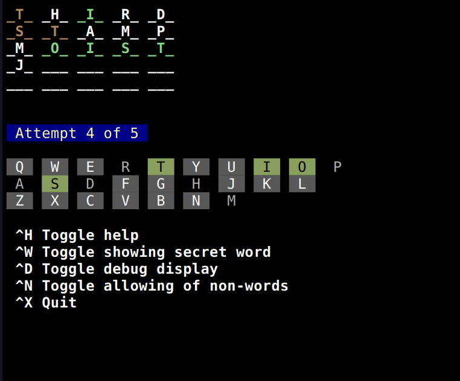

# WorldlePi

Welcome to WorldlePi, a Wordle clone that runs directly in your text terminal, with a minimal interface -- it works well through SSH even over mobile!.

Enjoy the classic word-guessing game with the convenience and simplicity of pre-web technology!  (Except maybe the 256 color support.. and python.. and github.  Nevermind, but it *could* be pre-web.)



## Features

* Some 256 color sequences are used if your term supports it.
* Normal Worldle-like functionality (try a word; matching letters with position show in green. Letters in the secret word, but not in the correct location of your guess, are brown).
* Debug and cheat mode are available.

## Problems / Things for the future:

* When using the linux dict (`/usr/share/dict/words`) I could use other word-lengths than 5. Unfortunately, that list is way too broad -- not designed for common use, so I switched to a word-list I grabbed from the [https://github.com/xereeto/wordleTTY](https://github.com/xereeto/wordleTTY) project, after trying some other approaches to have good word lists.
* The word-length and number of guesses are, thus, adjustable, but currently only by modifying the source code for it.
* Uhh... I'm using numpy right now, without good reason. That needs to be stripped out since it's just for storing a 2d array of letters, which can be changed to a list of lists with some coding.

## Installation

To install WorldlePi, follow these steps:

Clone the repository and install requirements:
```bash
$ git clone https://github.com/jaggzh/wordlepi.git
$ cd wordlepi
$ pip install -r requirements.txt
```

## Usage

To play WorldlePi, you can start the game using either of the following commands:

* Running directly as a script:
```bash
$ ./wordlepi
```

* Calling with python:
```bash
$ python wordlepi
```

Start guessing words and have fun!

